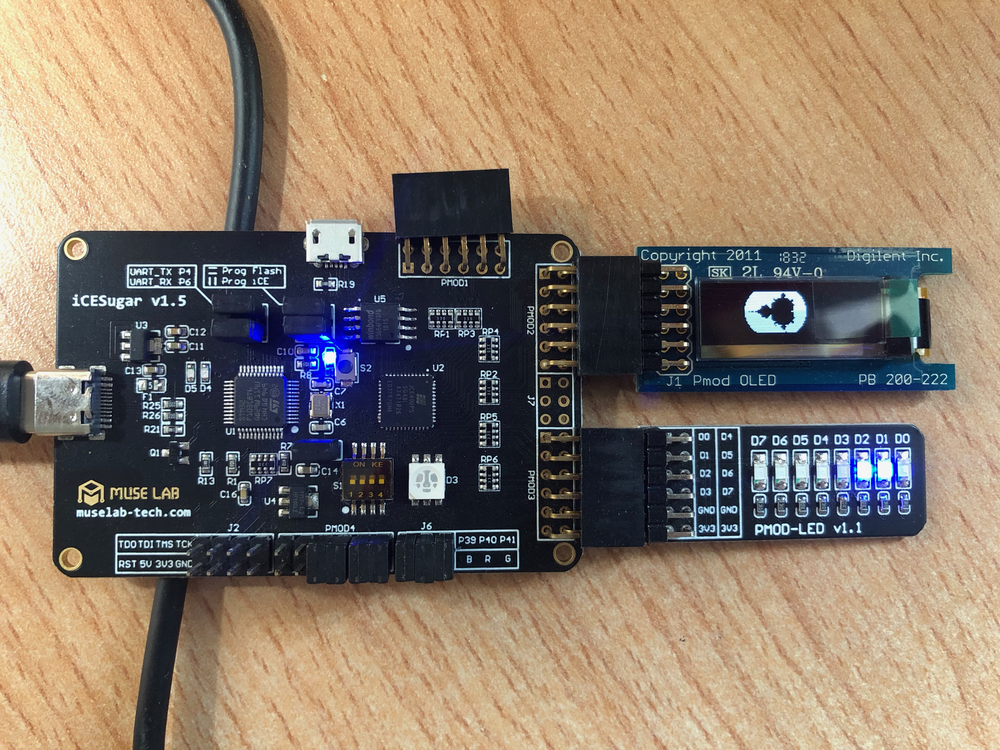

# Courtesy of https://github.com/laanwj/yosys-ice-experiments

- Display: [Digilent PmodOLED 128x32 grid SSD1306 module](https://store.digilentinc.com/pmod-oled-128-x-32-pixel-monochromatic-oled-display/)
- Connected to iCESugar on PMOD2
- Using 4-wire SPI 10MHz max
- iCE40UP5k FPGA, programmed using open source FPGA toolchain Yosys + nextpnr + IceStorm
- Image generated using Python script, sent from PC through FTDI serial-over-USB 1000000 baud

```
+------+         +------------+        +------+      +---------+
| Host |<------->| FTDI 2232H |------->| FPGA |----->| Display |
+------+   USB   +------------+ Serial +------+ SPI  +---------+
                                1M baud         (pmod conn)
```

Set up
--------------

Connect PmodOLED to PMOD2 on iCESugar, and optionally, Pmod-LED to PMOD3.

Note: you may need to change the function `detect_serial` in `util.py` to specify the serial interface.



PmodOLED
------------

Connector Pmod

Pin   | Signal    | Description
------|-----------|---------------------------------
1     | CS        | SPI Chip Select (Slave Select)
2     | SDIN      | SPI Data In (MOSI)
3     | None      | Unused Pin
4     | SCLK      | SPI Clock
7     | D/C       | Data/Command Control
8     | RES       | Power Reset
9     | VBATC     | V BAT Battery Voltage Control
10    | VDDC      | V DD Logic Voltage Control
5, 11 | GND       |
6, 12 | VCC       | Power Supply G

