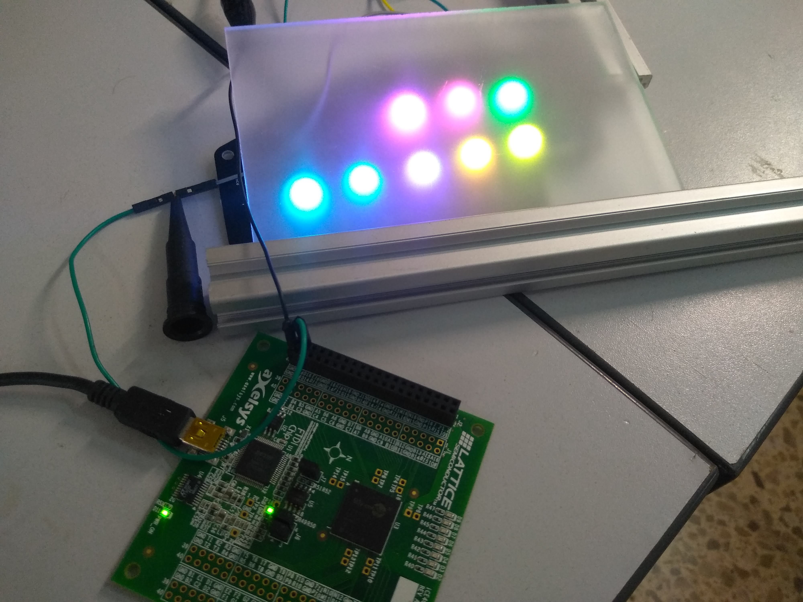
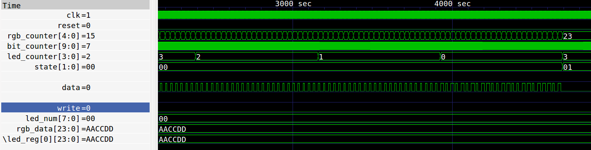

# WS2812 core

adapt from https://github.com/mattvenn/ws2812-core.git

very simple WS2812 LED driver written in Verilog. Demonstrates timing is working.

* Parameter NUM_LEDS sets the number of LEDs in the chain (up to 255)
* Data is RGB format, 24 bits.
* Data for each LED is loaded with the write signal
* expects clock to be 12 MHz

# Makefile

    make debug

Use iverilog to run the testbench and show the results with gtkwave

    make formal

Use symbiyosys to formally prove certain aspects of the core

    make prog

Synthesise and program bitstream to 8k dev board.
